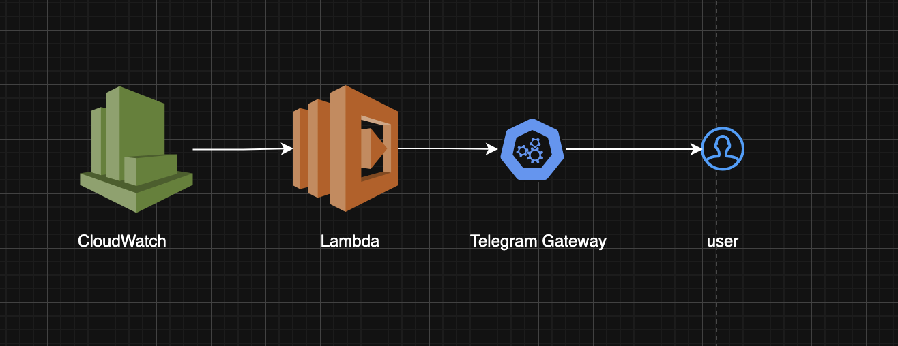

# 💰 AWS Cost Monitor

A Terraform-based solution that monitors your AWS spending and sends real-time alerts to Telegram when costs exceed defined thresholds.


## 🎯 Features

- **Multi-threshold Billing Alarms** — Set multiple cost thresholds (e.g., $1, $10, $50, $100)
- **Telegram Notifications** — Instant alerts via Telegram bot
- **Infrastructure as Code** — Fully managed with Terraform
- **Multi-environment Support** — Separate configs for general/production
- **Secure CI/CD** — GitHub Actions with OIDC authentication (no stored credentials)

## 🏗️ Architecture

```
┌─────────────────────┐     ┌──────────────────┐     ┌─────────────────┐
│   AWS CloudWatch    │────▶│  Lambda Function │────▶│    Telegram     │
│   Billing Alarms    │     │  (Python 3.9)    │     │    Bot API      │
└─────────────────────┘     └──────────────────┘     └─────────────────┘
         │                           │
         │                           │
         ▼                           ▼
┌─────────────────────┐     ┌──────────────────┐
│  Threshold: $1, $10 │     │   IAM Role for   │
│  $50, $100, $500    │     │   Lambda Exec    │
└─────────────────────┘     └──────────────────┘



```

## 📁 Project Structure

```
cost_monitor/
├── .github/
│   └── workflows/
│       └── terraform-ci.yml      # CI/CD pipeline
├── terraform/
│   ├── main.tf                   # Root module
│   ├── variables.tf              # Input variables
│   ├── output.tf                 # Outputs
│   ├── terraform.tf              # Provider config
│   ├── backend-general.hcl       # S3 backend (general)
│   ├── backend-production.hcl    # S3 backend (production)
│   └── modules/
│       ├── billing_alarm/        # CloudWatch alarms module
│       │   ├── main.tf
│       │   ├── variables.tf
│       │   └── output.tf
│       └── lambda/               # Telegram notifier module
│           ├── main.tf
│           ├── variables.tf
│           ├── output.tf
│           └── lamda_files/
│               └── alert_telegram_lambda.py
└── README.md
```

## 🚀 Quick Start

### Prerequisites

- AWS Account with billing alerts enabled
- Terraform >= 1.14
- Telegram Bot (create via [@BotFather](https://t.me/BotFather))
- GitHub repository (for CI/CD)

### 1. Create a Telegram Bot

1. Message [@BotFather](https://t.me/BotFather) on Telegram
2. Send `/newbot` and follow the prompts
3. Save the **API Token**

### 2. Get Your Telegram Chat ID

1. Message [@userinfobot](https://t.me/userinfobot) on Telegram
2. The bot will reply with your user info
3. Copy the **Id** value — this is your `TELEGRAM_CHAT_ID`

> 💡 **Tip:** For group chats, add the bot to the group and use [@RawDataBot](https://t.me/RawDataBot) to get the group chat ID (it will be a negative number).

### 3. Configure AWS OIDC for GitHub Actions

> 📚 **Full Guide:** [Use IAM roles to connect GitHub Actions to actions in AWS](https://aws.amazon.com/blogs/security/use-iam-roles-to-connect-github-actions-to-actions-in-aws/)

### 4. Set GitHub Secrets

Add these secrets to your repository:

| Secret | Description |
|--------|-------------|
| `TELEGRAM_TOKEN` | Bot API token from BotFather |
| `TELEGRAM_CHAT_ID` | Your Telegram chat ID |

### 5. Deploy

Push to the `general` or `main` branch to trigger deployment:

```bash
git push origin general
```

## ⚙️ Configuration

### Customize Thresholds

Edit `terraform/main.tf`:

```hcl
module "billing_alarm_general" {
  source            = "./modules/billing_alarm"
  billing_threshold = [5, 25, 50, 100, 200]  # Your thresholds in USD
  alarm_actions     = [module.lambda_action.lambda_function_arn]
  currency          = "USD"
}
```

### Variables

| Variable | Description | Default |
|----------|-------------|---------|
| `aws_region` | AWS region | `us-east-1` |
| `billing_threshold` | List of cost thresholds | `[1, 10, 50, 100, 500]` |
| `currency` | Currency for billing | `USD` |
| `telegram_token` | Telegram bot token | — |
| `telegram_chat_id` | Telegram chat ID | — |

## 🔐 Security

- **OIDC Authentication** — No long-lived AWS credentials stored in GitHub
- **Least Privilege** — IAM roles scoped to specific resources
- **Sensitive Variables** — Terraform marks tokens as sensitive
- **Environment Separation** — Different AWS accounts for general/production

## 🔔 Alert Example

When a threshold is breached, you'll receive a Telegram message like:

```
🚨 AWS Alert 🚨

Alarm: Billing_Alarm_50
Status: ALARM
Reason: Threshold Crossed: 1 datapoint [52.34] 
        was >= the threshold (50.0)
```

## 📝 CI/CD Pipeline

The GitHub Actions workflow:

1. **Checkout** — Fetches the code
2. **Configure AWS** — Assumes role via OIDC
3. **Terraform Init** — Initializes with remote backend
4. **Terraform Validate** — Validates configuration
5. **Terraform Plan** — Shows planned changes
6. **Terraform Apply** — Applies changes (on `main` branch)

## 🛠️ Local Development

```bash
cd terraform

# Initialize
terraform init -backend-config=backend-general.hcl

# Set variables
export TF_VAR_telegram_token="your-bot-token"
export TF_VAR_telegram_chat_id="your-chat-id"

# Plan
terraform plan

# Apply
terraform apply
```
